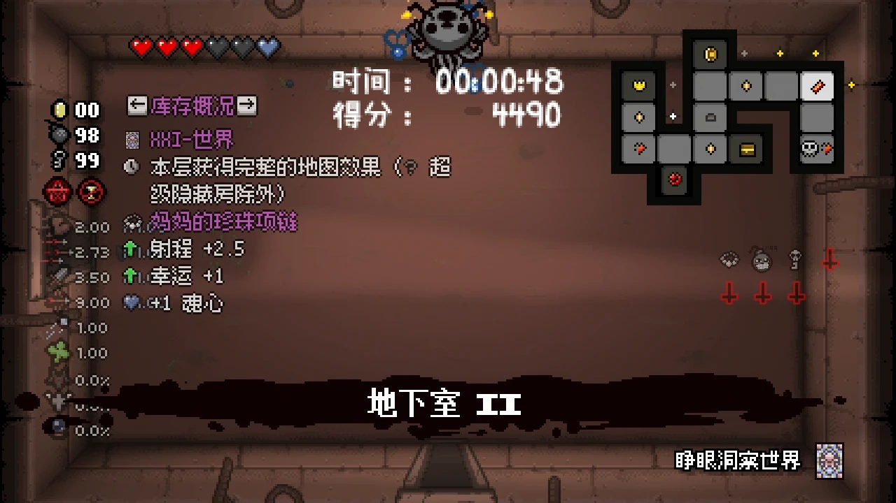
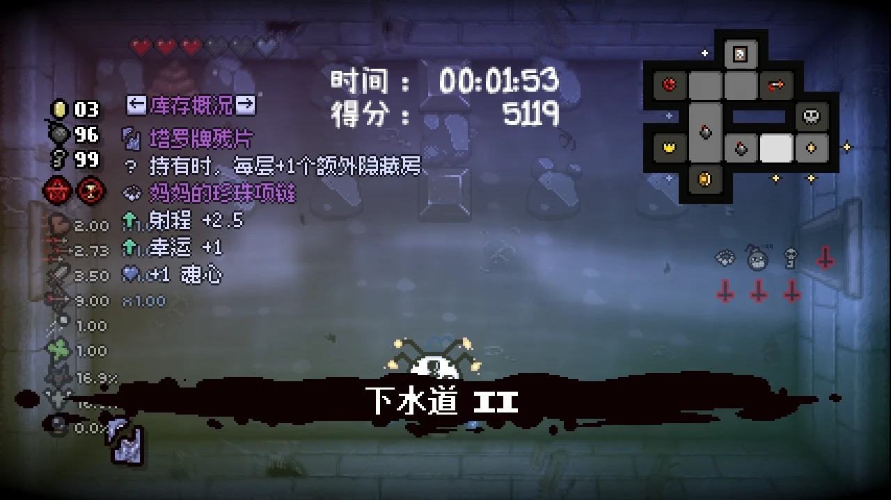
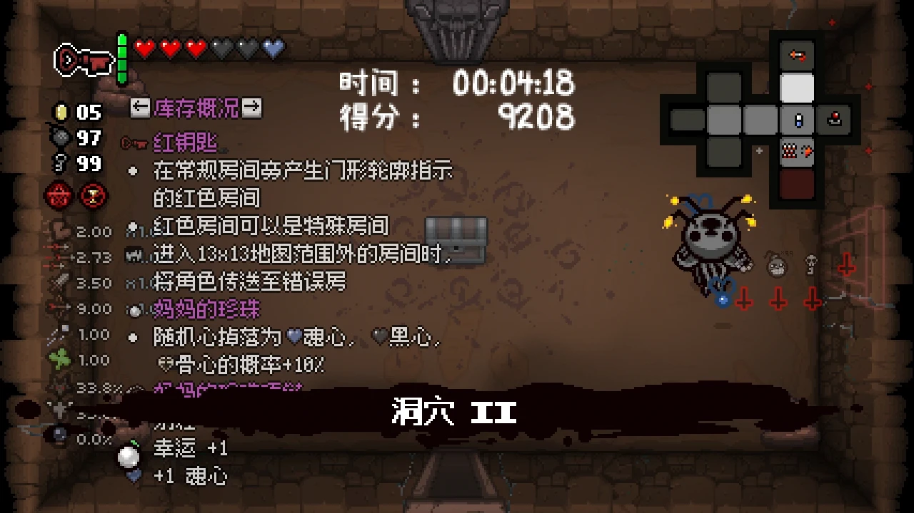

# Lazy Delver

Marks possible locations for Secret Rooms and Super Secret Rooms on the mini-map, gradually eliminating incorrect candidates as you explore.

|  |  |  |
|-|-|-|

## Usage

- **Hold Tab** to show markers
- Marker colors:
  - **White** — Normal Secret Room candidate
  - **Gold**  — Super Secret Room candidate
  - **Red**   — Ultra Secret Room candidate (only shown while holding Red Key / Cracked Key / Soul of Cain)
- Marker brightness:
  - **Bright** — All adjacent rooms have been entered and the door‑to‑wall path is passable
  - **Dim**    — Some adjacent rooms have not yet been explored
- After entering a room, if a candidate’s door‑to‑wall path is blocked (a solid wall with no door), that candidate is removed
- Bomb explodes near a door position → if the corresponding candidate is a fake, its marker is removed
- Once the real Secret Room appears on the floor map, all fake candidates of the same type are automatically cleared

## Compatible Items & Special Handling

- Active items
    - Crystal Ball
    - Book of Secrets
    - Dad's Key
- Cards
    - XIX - The Sun
    - XXI - The World
    - Ansuz
    - Get Out Of Jail Free Card
    - Soul of Cain
- Pills
    - I Can See Forever!
- Passive items
    - Blue Map
    - X-Ray Vision
    - The Mind
    - Dog Tooth
    - YO LISTEN!
    - Spelunker Hat
- Compatible with Mirrored World
- Curse of the Lost / Home / the Ascent / Greed Mode / special rooms not displayed on the map: not handled

## Notes

- Because The Binding of Isaac does not provide mini‑map APIs, it is not possible to freely draw on or inspect the mini-map state. Markers can therefore only be shown by manually calculating positions when Tab is pressed.
- Normal Secret Rooms typically connect to 2 or more rooms. Only in extremely rare cases does a Normal Secret Room connect to just one room. Therefore, the mod only marks candidate positions with 2 or more connections, while guaranteeing that the real Secret Room is always marked. The same applies to Ultra Secret Rooms.
- The candidate markers may not cover every edge case. If you find a reproducible issue, please report it via an issue or in the comments.
- Bomb detection range is limited (radius ~80 pixels); an explosion must occur close to the door position for it to trigger exclusion. Using Terra / rock wave or other methods will **not** remove candidates.

# Lazy Delver

在小地图上标记隐藏房和超级隐藏房的**可能位置**，随探索逐步排除错误位置。

## 用法

- **按住 Tab 键** 显示标记
- 标记颜色：
  - **白色** — 普通隐藏房候选
  - **金色** — 超级隐藏房候选
  - **红色** — 究极隐藏房候选（红钥匙/红钥匙碎片/该隐的魂石持有时才显示）
- 标记亮度：
  - **明亮** — 该位置所有相邻房间均已进入过，门到墙的路径可通行
  - **暗淡** — 部分相邻房间尚未探查
- 进入房间后，若某个候选位置的门到墙路径被阻断（墙壁完整无门），该候选被移除
- 炸弹在门位附近爆炸 → 若对应的是假候选则排除标记
- 真实隐藏房在楼层地图上出现后，同类假候选自动清除

## 兼容物品与特殊情况处理

- 主动道具
    - 水晶球
    - 秘密之书
    - 爸爸的钥匙
- 卡牌
    - XIX-太阳
    - XXI-世界
    - 诸神符文
    - 免费保释卡
    - 该隐的魂石
- 药丸
    - 我能永远看清！
- 被动道具
    - 蓝地图
    - X光透视
    - 思想
    - 狗牙
    - 嘿，听好！
    - 探窟帽
- 兼容镜像世界
- 迷途诅咒/家/回溯/贪婪模式/不在地图上的特殊房间：不处理

## 注意事项

- 由于以撒没有提供小地图相关的 API，无法自由绘制或检查小地图状态，所以只能在按下 TAB 时手动计算位置显示标记。
- 标记候选可能无法覆盖所有特殊情况，如果有确定可复现的问题欢迎提 issue 或在评论区反馈。
- 普通隐藏房一般与大于等于 2 个房间相连接，只有在极少数情况下，普通隐藏房才只与一个房间相连接，因此模组仅标记连接数大于等于二的候选位置，但保证真实隐藏房一定被标记。究极隐藏房也类似。
- 炸弹检测范围有限（半径约 80 像素），需在门位附近爆炸才能触发排除。使用地球/岩石波等其他手段不会排除候选。
